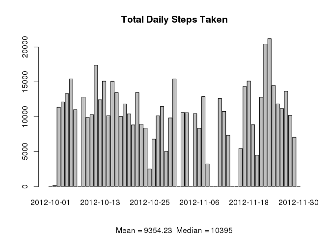
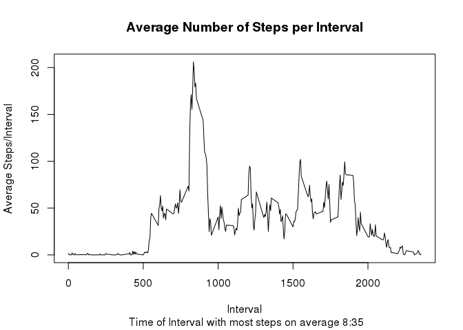
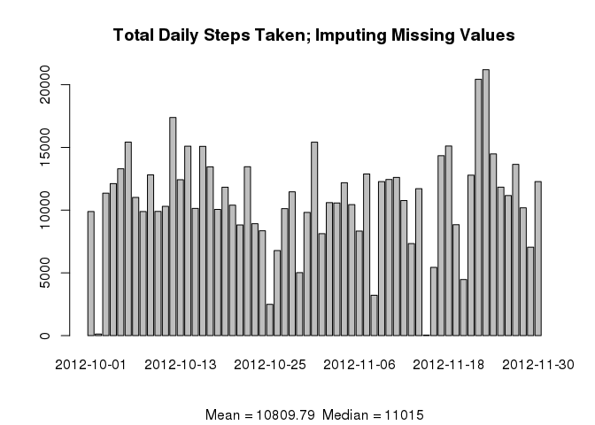
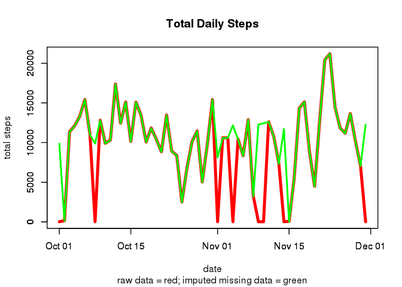
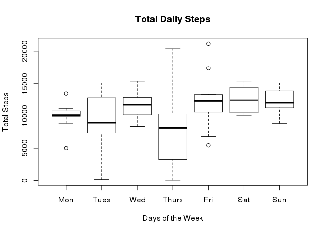

# Reproducible Research: Peer Assessment 1

### loading knitr library

```r
    library(knitr)
    library(xtable)
```

### Loading and preprocessing the data
 - *activity,csv* contains number-of-steps data from a single individual at five minute intervals over a two month period from 10/01/2012 ro 11/30/2012
  - missing step data is represented by *NA*
  - *preprocessing* consists of adding the day of the week as a separate column to the data frame as well as changing the data type of the *date* column to *Date* 


```r
  ## 
  loadData <- function(name) {
      df_temp <- read.csv(name, header=TRUE)
      df_temp$date <- as.Date(df_temp$date)
      df_temp <- cbind(df_temp,weekdays(df_temp$date)) 
      colnames(df_temp)[4] <- "dayOfWeek"
      df_temp
  }
  df <- loadData(name="activity.csv")
```

### What is mean total number of steps taken per day?
 - for each of the 61 days of the study, there is a total number of steps taken by the participant. There is therefore an average and median number of daily steps
 - mean total number of steps per day and median number of total steps per day  are  single numbers. We will show a histogram of total number of daily steps and attach the mean and median to this histogram.
 

```r
  ## 
  calculateMeanAndMedian <- function(s,d,m) {
    sums <- aggregate(s,list(date=d),FUN=sum,na.rm=TRUE)
    meanTotalSteps <- mean(sums$x,na.rm=TRUE)
    medianTotalSteps <-median(sums$x,na.rm=TRUE)
    barplot(sums$x,names.arg=sums$date, 
            main=m, 
            sub=paste("Mean = ",
                      format(meanTotalSteps, digits=2, nsmall=2),
                      "  Median = ",
                      format(medianTotalSteps, digits=2, nsmall=2) ,
                      sep="")  
            )
    meanAndMedian <- c(meanTotalSteps,medianTotalSteps)
    meanAndMedian
  }
  mAndM <- calculateMeanAndMedian(s=df$steps,d=df$date,"Total Daily Steps Taken")  
```

 

```r
  rawMean <- mAndM[1]
  rawMedian <- mAndM[2]
```

## What is the average daily activity pattern?
 - each day is broken up into 5-minute intervals
 - across the two months of the study, for each  interval, there is an average number of steps
 - in this section we will plot these interval averages
 - in addition, we identify the interval with the maximum average number of steps taken
 

```r
    ##
    plotIntervalAverages <- function (s,i) {
        means <- aggregate(s,list(interval= i),FUN=mean,na.rm=TRUE)
        maxSteps <- max(means$x,na.rm=TRUE)
        maxStepsInterval <- means$interval[abs(maxSteps - means$x) < 0.001]
        maxStepsTimeHrs <- maxStepsInterval %/% 100
        maxStepsTimeMins <- maxStepsInterval - maxStepsTimeHrs*100
        maxStepsTime <- paste(maxStepsTimeHrs,":",maxStepsTimeMins,sep="")
        plot(means$interval,means$x, type= "l",
             main="Average Number of Steps per Interval",
             sub = paste(" Time of Interval with most steps on average ", maxStepsTime,sep=""),
             xlab = "Interval",
             ylab="Average Steps/Interval"
             )
      
    }
    plotIntervalAverages(df$steps,df$interval)
```

 


## Imputing missing values
 - calculating the number of rows with missing (NA) values
 

```r
    ##
    missingValueRows <- function(mDF) {
        missingSteps <- length(which(is.na(mDF$steps)))       
        missingDates <- length(which(is.na(mDF$date)))
        missingIntervals <- length(which(is.na(mDF$interval)))
        missingRows <- length(which(is.na(mDF$steps) | is.na(mDF$date) | is.na(mDF$interval)))
        msg1 <- paste("Rows w/ Missing Steps = ",as.character(missingSteps))
       # print ( msg)
        msg2 <-  paste("Rows w/ Missing Dates = ",as.character(missingDates))
       # print (msg)
        msg3 <- paste("Rows w/ Missing Intervals = ",as.character(missingIntervals))
       # print ( msg)
        msg4 <- paste("Rows w/ Missing Values = ",as.character(missingRows))
       # print (msg )
       c(msg1,msg2,msg3,msg4)
    }    
    msgs<- missingValueRows(df)
    msgs
```

```
## [1] "Rows w/ Missing Steps =  2304"  "Rows w/ Missing Dates =  0"    
## [3] "Rows w/ Missing Intervals =  0" "Rows w/ Missing Values =  2304"
```
  
  - next we implement a strategy for replacing missing values
  - we choose to look at the mean step count for the **same timeslot** and the **same day of the week** (Sun, Mon, etc) for  our strategy for replacing missing values.  
   - we use this strategy to rework dataset to contain no missing values
  

```r
    ## function to calculate one mean for specific interval and day of the week
    oneMean <- function(df2,intr,day) {
        values <- subset(df2, df2$interval == intr & df2$dayOfWeek == day)
        mMean <- mean(values$steps,na.rm=TRUE)
        mMean    
    }
    
    ## function calculates the mean of existing step counts on specific days of the week (ignoring NA entries)
    ## in a particular timeslot over a specified range of data frame entries
    ## It then replaces NA values with the mean for this timeslot and this day of the week
    ## THIS TAKES A LONG TIME
    dayOfWeekTimeslotMean <- function (df1) {
        ## iterate over each time interval and each day of the week
        for (i in seq(0,2355,by=5)) {
           for( j in c("Monday","Tuesday","Wednesday","Thursday","Friday","Saturday","Sunday")) {
              mMean <- oneMean(df1, i,j)
              df1$steps[is.na(df1$steps) & df1$interval == i & df1$dayOfWeek == j] <- mMean          
           }
        } 
        df1$steps <- as.integer(df1$steps)
        df1
    }
    
    df1 <- dayOfWeekTimeslotMean(df)
```

  - We now use new data set to prepare a histogram of the total number of steps taken each day


```r
    mAndM <- calculateMeanAndMedian(s=df1$steps,d=df1$date,"Total Daily Steps Taken; Imputing Missing Values")
```

 

```r
    imputedMean <- mAndM[1]
    imputedMedian <- mAndM[2]
```

  - We have recalculated the *mean* and *median* number of steps taken each day. Do these numbers differ from those previously calculated by ignoring *NA* entries
  - There was a 15% increase in mean and 6% increase in median measures  respectively with imputed values. Since there were 13% missing values in the original data file this may be expected. The differences may be due to our choice of estimator for  the missing values. This can be better viewed as a table seen below:
<center>


```r
        meanAndMedianTable <- function (raw, imputed){
            meanIncrease <- ((imputed[1]-raw[1])/raw[1])*100
            medianIncrease <- ((imputed[2] - raw[2])/raw[2])*100
            mMdf <- data.frame(raw.Data = raw, imputed.Data = imputed)  #, increase < c(meanIncrease,medianIncrease))
            mMdf <- cbind(mMdf, c(meanIncrease ,medianIncrease))
            colnames(mMdf)[3] <- "percent increase"
            rownames(mMdf)[1] <- "Mean"
            rownames(mMdf)[2] <- "Median"
            xt<- xtable(mMdf,caption="Means and Medians")
            xt
            
        }
       xt<- meanAndMedianTable(c(rawMean,rawMedian),c(imputedMean,imputedMedian))
       print(xt,type="html",include.rownames=TRUE)
```

<!-- html table generated in R 3.1.2 by xtable 1.7-4 package -->
<!-- Sun Feb 15 16:22:26 2015 -->
<table border=1>
<caption align="bottom"> Means and Medians </caption>
<tr> <th>  </th> <th> raw.Data </th> <th> imputed.Data </th> <th> percent increase </th>  </tr>
  <tr> <td align="right"> Mean </td> <td align="right"> 9354.23 </td> <td align="right"> 10809.79 </td> <td align="right"> 15.56 </td> </tr>
  <tr> <td align="right"> Median </td> <td align="right"> 10395.00 </td> <td align="right"> 11015.00 </td> <td align="right"> 5.96 </td> </tr>
   </table>
  

</center>
  - What is the impact of imputing missing data on the estimates of total daily number of steps?
- Obviously, the total number of steps per day can only increase. 
- To compare total daily steps with and without missing data we view a line-plot of both.
  

```r
    ## put two line plots on the same graph and see the difference
    plot2Lines <- function (df1, df) {
        sums <- aggregate(df$steps,list(date=df$date),FUN=sum,na.rm=TRUE)
        sums$date <-as.Date(sums$date)
        sums2<-  aggregate(df1$steps,list(date=df1$date),FUN=sum,na.rm=TRUE)
        sums2$date <- as.Date(sums2$date)
        plot( sums$date, sums$x, type="l", col="red", lwd=5,xlab="",ylab="")
        par(new=TRUE)
        plot( sums2$date,sums2$x, type="l", col="green",lwd=3,xlab="date", ylab="total steps", 
              main= "Total Daily Steps", sub= "raw data = red; imputed missing data = green" )    
    }
    plot2Lines(df1,df)
```

 
  

### Are there differences in activity patterns between weekdays and weekends?
 - We show the average daily steps for weekday days as compared to average daily steps for weekend days
 - we use the data set containing imputed missing data


```r
    ## 
    weekDaysVersusWeekends <- function (df1) {
        sums <- aggregate(df1$steps,list(date=df1$date,dayOfWeek=df$dayOfWeek),FUN=sum,na.rm=TRUE)
        # x1  = factor(x, levels=c("B", "C", "A"))
        sums$dayOfWeek <- factor(sums$dayOfWeek, 
                            levels = c("Monday","Tuesday","Wednesday","Thursday","Friday","Saturday","Sunday"))
        boxplot(sums$x~sums$dayOfWeek,data=sums,main="Total Daily Steps", 
                xlab="Days of the Week", ylab="Total Steps", 
                names=c("Mon","Tues","Wed","Thurs","Fri","Sat","Sun") ) 
        
    }
    weekDaysVersusWeekends(df1)
```

 

 - From the*boxplot* we can see that weekend days Saturday and Sunday have very similar behaviour and they are sightly more active days, in general, than weekdays.
 
